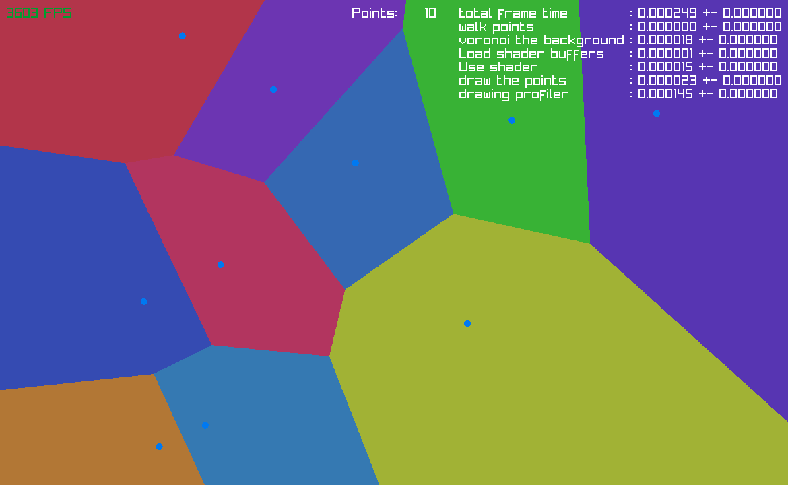

# Voronoi Diagrams

Simple Voronoi diagram with bouncing points.
Various backends, with differing performance levels
and characteristics, for your enjoyment.




## Key Binds

- **[SPACE]** -> Pause Simulation
- **R** -> Reset profiling statistics. (it might lag behind if you change the number of points fast)
- **P** -> Toggle points visibility (this is also something that can speed up the shaders, as they themselves are not the bottleneck)

## Setup

Requires raylib. Makefile assumes it has been installed system wide.

```bash
$ make
$ ./build/bin/main_* # where '*' is one of the possible backends


# simple solutions, CPU based

# max 10-20 before dropping bellow 60fps
$ ./build/bin/main_simple
# max 60-70 before dropping bellow 60fps
$ ./build/bin/main_simple_threaded


# shader solutions, GPU based

# Cannot draw more than 256 points.
$ ./build/bin/main_shader
# max 6000-7000 points, more than enough for everybody
# NOTE won't work without some tinkering with your raylib install.
$ ./build/bin/main_shader_buffer


# when your done, just delete the build/ folder
$ make clean
```

## NOTE
main_shader_buffer requires the **GRAPHICS_API_OPENGL_43** flag
to be set when compiling raylib, (this is not set by default).

It fails because rlgl shader_buffer requires *SSBO* to be turned on,
and the shader_buffer is needed to hold an arbitrary number of points.

```bash
# when compiling raylib
$ cd raylib/src/
$ make GRAPHICS=GRAPHICS_API_OPENGL_43

# install or otherwise provide.
$ sudo make install
```